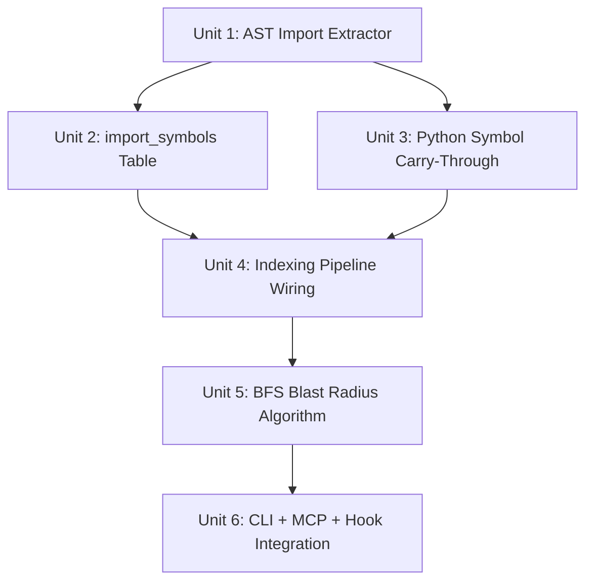

# feat: Symbol-level blast radius

## Overview

Add symbol-level import tracking and transitive impact analysis to sextant. When a file changes, identify which specific exports changed and trace only the files that consume those exports — not every file that imports the module.

## Problem Frame

File-level blast radius degenerates to "everything depends on everything" for utility files. `lib/utils.js` (fan-in 8) would flag 8+ files for any change, even if only one function was modified. LLM agents work at symbol/function granularity (Edit targets specific strings, Grep searches for specific functions), so blast radius must match that granularity to provide signal instead of noise.

The prerequisite data is already extracted and discarded. JS regex captures `import { loadDb, persistDb } from './graph'` but only persists the specifier path. Python AST captures `from module import name` with `imp.name` but `normalizeImports()` discards it. Both languages have the symbol names at extraction time — they just aren't stored.

(see origin: `docs/ideas/001-transitive-blast-radius.md` for full research findings)

## Requirements Trace

- R1. Capture imported symbol names during extraction (JS/TS and Python)
- R2. Persist symbol-level import edges in graph.db
- R3. Compute transitive blast radius given a file and optionally specific changed symbols
- R4. Gracefully degrade to file-level when symbol data is unavailable (namespace imports, non-destructured CJS)
- R5. Expose via CLI command, MCP tool, and hook context injection
- R6. Stay within the 200ms hook budget for blast radius computation
- R7. Track "symbol coverage %" as a health metric (what fraction of import edges have symbol data)

## Scope Boundaries

- No function-call-site analysis (`const g = require('./graph'); g.loadDb()` — the consumed symbol is at the call site, not the import site). This would require data-flow analysis beyond static import parsing.
- No `import type` tracking for TypeScript type-only imports (zero runtime impact).
- No cross-repo blast radius.
- No incremental/cached blast radius — compute fresh each time (BFS is <20ms on 5k files).
- No hook blast radius injection in Phase 1 — without export diffing, the hook can only do file-level BFS which duplicates existing fan-in. Hook injection deferred to Phase 2.
- Export diffing (detecting which exports changed) is Phase 2 work. Phase 1 uses user-supplied or MCP-supplied symbol names via CLI and MCP tool. Phase 2 enables automatic symbol detection and hook integration.

## Context & Research

### Relevant Code and Patterns

**Import extraction pipeline (end-to-end):**
1. `lib/extractors/javascript.js:extractImports()` → regex, returns `[{ specifier, kind }]` — symbols discarded
2. `lib/extractors/python.js:normalizeImports()` → AST result normalized, `imp.name` discarded
3. `lib/extractor.js:extractImports()` → dispatches to language extractor, passes through unchanged
4. `lib/intel.js:indexOneFileUnlocked()` → calls extractImports, resolves paths, calls `graph.replaceImports()`
5. `lib/graph.js:replaceImports()` → stores `(from_path, specifier, to_path, kind, is_external)`

**Schema pattern:** `ensureSchema()` in graph.js uses `CREATE TABLE IF NOT EXISTS` — idempotent, no versioned migrations. New tables appear on next `loadDb()`.

**BFS pattern:** `graph.findReexportChain()` — BFS with visited set, depth cap, directional hop-to-hop queries. Exact pattern to follow.

**AST extractor:** `js_ast_exports.js` already has `@babel/parser` configured with `PARSE_OPTS` including TypeScript, JSX, decorators. Could be extended for import symbol extraction as an AST path alongside the regex path.

### Institutional Learnings

- **NULL-ify don't DELETE** on edge tables — `deleteFile()` must clean up `import_symbols` without destroying edges owned by other files
- **BFS must be directional** — each hop feeds into the next, not a global search. Test with diamond+tail graphs
- **Corrupt DB recovery** — `ensureSchema` is inside try/catch in `loadDb()`, new tables inherit this safety
- **XML escape for hook output** — any blast radius text injected to stdout must pass through `stripUnsafeXmlTags()`
- **200ms shared hook budget** — BFS on in-memory SQLite takes <20ms, well within budget

## Key Technical Decisions

- **AST for JS/TS import symbols, not regex**: The existing regex captures everything between `import` and `from` as a non-capturing group. Extracting symbol names from this requires parsing destructuring syntax (nested braces, aliases, defaults, type-only). `@babel/parser` already handles all of this. Add an `extractImportsAST()` function alongside `extractExportsAST()` in `js_ast_exports.js`, with regex fallback for parse failures. Rationale: the AST path gives exact symbol names including `import { foo as bar }` aliases and `import type` filtering, which regex would need multiple complex patterns to handle.

- **Separate `import_symbols` table, not a column on `imports`**: Import symbols are a one-to-many relationship (one import edge → multiple symbols). A separate table with `(from_path, to_path, symbol_name)` PK is cleaner than JSON-in-a-column and enables direct SQL queries. Follows the pattern established by the separate `reexports` table.

- **Namespace imports stored as `*`**: `import * as graph from './graph'` and non-destructured `const graph = require('./graph')` are stored with `symbol_name = '*'` meaning "all exports potentially consumed." BFS treats `*` as file-level fallback — the edge contributes to blast radius regardless of which specific exports changed. This is no worse than current behavior.

- **`import type` excluded**: TypeScript `import type { Foo }` has zero runtime impact. AST traversal filters these out by checking `importKind === 'type'` on the ImportDeclaration node. This prevents type-only imports from inflating blast radius.

- **Python symbol capture in `normalizeImports()`**: The AST data already has `imp.name` for `from X import Y` statements. Simply carry it through instead of discarding. `import os` (no specific symbol) gets `symbol_name = '*'`.

## Open Questions

### Resolved During Planning

- **Q: AST or regex for JS import symbols?** → AST. The regex approach requires parsing destructuring syntax that `@babel/parser` already handles. The AST extractor module already exists with the right config.
- **Q: How to handle `import type`?** → Filter out. Check `importKind === 'type'` on ImportDeclaration and `imported.type === 'StringLiteral'` edge cases. Zero runtime impact = zero blast radius contribution.
- **Q: How does Python extractor handle this?** → `python_ast.py` already captures `imp.name`. `normalizeImports()` discards it. Carry it through.

### Deferred to Implementation

- **Q: Exact AST node types for all import forms.** The AST walker will need to handle ImportDeclaration (ESM), CallExpression with `require` (CJS), and VariableDeclarator with destructuring. The exact node shapes depend on @babel/parser's AST — resolve during implementation by inspecting actual AST output.
- **Q: Should export diffing be synchronous or async?** When `indexOneFileUnlocked` re-indexes a file, it needs the old exports to compute the diff. Current `queryExports(db, rel)` is synchronous. Likely fine, but verify during implementation.
- **Q: CJS destructuring depth.** `const { a: { b } } = require('./x')` — nested destructuring. Decide during implementation whether to support depth > 1 or only top-level.

## High-Level Technical Design

> *This illustrates the intended approach and is directional guidance for review, not implementation specification. The implementing agent should treat it as context, not code to reproduce.*

```
File changed (watcher/scan)
    │
    ▼
extractImports(code, type) ──── NEW: returns [{ specifier, kind, symbols? }]
    │                                 symbols = ["loadDb", "persistDb"] or ["*"]
    ▼
resolveImport() ──────────────── unchanged (resolves specifier → file path)
    │
    ▼
graph.replaceImports() ──────── unchanged (file-level edges)
graph.replaceImportSymbols() ── NEW: symbol-level edges in import_symbols table
    │
    ▼
[On blast radius query]
    │
    ▼
graph.blastRadius(db, filePath, { symbols?, maxDepth?, maxFiles? })
    │
    ├── symbols provided → query import_symbols for files importing those specific symbols
    ├── symbols = null → fallback to file-level queryDependents (all importers)
    └── symbol = "*" edges → always included (namespace imports)
    │
    ▼
BFS expansion (depth-bounded, visited set, cycle-safe)
    │
    ▼
Categorize: direct / transitive / test / entry point
    │
    ▼
Return { affected, stats }
```

## Implementation Units



- [ ] **Unit 1: AST-based JS/TS import symbol extraction**

**Goal:** Extract imported symbol names from JS/TS source using `@babel/parser`, with regex fallback. Return symbols alongside specifiers.

**Requirements:** R1

**Dependencies:** None

**Files:**
- Modify: `lib/extractors/js_ast_exports.js` (add `extractImportsAST` alongside existing `extractExportsAST`)
- Modify: `lib/extractors/javascript.js` (call AST path first, regex fallback; carry `symbols` in return value)
- Test: `test/extractors/javascript.test.js` (symbol extraction assertions)
- Test: `test/extractors/js-ast-fallback.test.js` (fallback still works with symbols field)

**Approach:**
- Add `extractImportsAST(code, filePath)` to `js_ast_exports.js`. Walks AST for `ImportDeclaration` nodes, extracts imported specifier names. Filters `import type` by checking `importKind`. Handles: named imports (`{ a, b }`), default imports (`default`), namespace imports (`*`), aliases (`{ a as b }` → captures `a`, the exported name). Returns `[{ specifier, kind, symbols }]` or `null` on parse failure.
- For CJS: walk `VariableDeclarator` nodes where the init is a `CallExpression` to `require()`. If the id is an `ObjectPattern` (destructuring), extract property key names as symbols. If the id is an `Identifier` (no destructuring), symbol is `*`.
- **Critical: symbol-aware deduplication.** The AST walker may produce multiple entries for the same specifier (e.g., `import { a } from './x'` and `import { b } from './x'` on separate lines). The existing `dedupe()` in `javascript.js` (line 63) dedupes by `kind\0specifier` and discards duplicates entirely. This MUST be replaced with a merge-dedupe: group entries by `kind\0specifier`, union their `symbols` arrays, emit one entry per group. Without this fix, the second import's symbols are silently lost.
- In `javascript.js`: call `extractImportsAST` first. If null (parse failure), fall back to regex `extractImports` (which returns symbols as `["*"]` since regex can't reliably parse the clause). Apply merge-dedupe to the unified `[{ specifier, kind, symbols }]` return shape.

**Patterns to follow:**
- `extractExportsAST` in `js_ast_exports.js` — same module, same `PARSE_OPTS`, same null-on-failure contract
- `extractImports` in `javascript.js` — same fallback pattern as `extractExports`

**Test scenarios:**
- Happy path: `import { useState, useEffect } from 'react'` → symbols `["useState", "useEffect"]`, specifier `"react"`
- Happy path: `import React from 'react'` → symbols `["default"]`, specifier `"react"`
- Happy path: `import * as path from 'path'` → symbols `["*"]`, specifier `"path"`
- Happy path: `const { loadDb, persistDb } = require('./graph')` → symbols `["loadDb", "persistDb"]`, specifier `"./graph"`
- Happy path: `const graph = require('./graph')` → symbols `["*"]`, specifier `"./graph"`
- Edge case: `import { foo as bar } from './mod'` → symbols `["foo"]` (the exported name, not the local alias)
- Edge case: `import type { Foo } from './types'` → excluded entirely (TypeScript type-only)
- Edge case: `import { type Foo, bar } from './mod'` → symbols `["bar"]` only (inline type specifier filtered)
- Error path: unparseable file → returns null, regex fallback produces symbols `["*"]`
- Integration: existing import specifier extraction still works unchanged (backward compatible return shape)

**Verification:**
- All existing `javascript.test.js` import tests still pass (backward compatibility)
- New symbol extraction tests pass for all import forms
- AST fallback to regex works and produces `["*"]` symbols

---

- [ ] **Unit 2: `import_symbols` table and graph queries**

**Goal:** Add the `import_symbols` table to graph.db and the CRUD + query functions to graph.js.

**Requirements:** R2, R4

**Dependencies:** None (can parallelize with Unit 1)

**Files:**
- Modify: `lib/graph.js` (schema, replaceImportSymbols, findImportersOfSymbols, deleteFile cleanup, blastRadius stub)
- Test: `test/graph.test.js` (import_symbols CRUD + query tests)

**Approach:**
- Add to `ensureSchema()`:
  ```sql
  CREATE TABLE IF NOT EXISTS import_symbols (
    from_path TEXT NOT NULL,
    to_path TEXT NOT NULL,
    symbol_name TEXT NOT NULL,
    kind TEXT,
    updated_at_ms INTEGER,
    PRIMARY KEY (from_path, to_path, symbol_name)
  );
  CREATE INDEX IF NOT EXISTS idx_import_symbols_to_symbol
    ON import_symbols(to_path, symbol_name);
  ```
- Add `replaceImportSymbols(db, fromRelPath, symbolEdges)` — delete-then-insert pattern matching `replaceImports`/`replaceExports`
- Add `findImportersOfSymbols(db, filePath, symbolNames)` — query files that import specific symbols from a given file using exact case-sensitive matching (symbol names are case-sensitive in JS/Python). Handles `*` wildcard: if an importer has `symbol_name = '*'`, it matches ANY queried symbol
- Add to `deleteFile()`: `DELETE FROM import_symbols WHERE from_path = ?` (owned edges) AND `DELETE FROM import_symbols WHERE to_path = ?` (referenced edges). NOTE: unlike the `imports` table, we use DELETE (not NULL-ify) for both directions because `to_path` is part of the PRIMARY KEY — setting it to NULL would break uniqueness invariants (SQLite treats NULL != NULL in PKs, allowing duplicate rows). This is safe because `import_symbols` rows are fully derivable from the `imports` table + extractor output and will be reconstructed on the next scan.

**Patterns to follow:**
- `replaceReexports()` in graph.js — same delete-then-insert pattern
- `deleteFile()` — follows the `reexports` table pattern (DELETE both directions) rather than the `imports` table pattern (NULL-ify to_path) because `to_path` is in the PK

**Test scenarios:**
- Happy path: insert import symbols for file A importing {foo, bar} from file B, query back, verify both present
- Happy path: `findImportersOfSymbols(db, "B", ["foo"])` returns file A but not file C which imports {baz} from B
- Happy path: `findImportersOfSymbols(db, "B", ["foo"])` also returns file D which has `symbol_name = '*'` (namespace import)
- Edge case: `replaceImportSymbols` called twice for same file overwrites previous data (idempotent)
- Edge case: empty symbols array → no rows inserted, no crash
- Edge case: `findImportersOfSymbols` with no matches returns empty array
- Error path: `deleteFile("B")` deletes import_symbols rows where `to_path = "B"` (referenced edges cleaned up, reconstructed on rescan)
- Error path: `deleteFile("A")` deletes rows where `from_path = "A"` (owned edges removed)
- Integration: new table appears on existing databases via `ensureSchema` (CREATE TABLE IF NOT EXISTS)

**Verification:**
- All existing graph.test.js tests still pass
- New import_symbols tests pass for CRUD, wildcard matching, and deleteFile cleanup

---

- [ ] **Unit 3: Python import symbol carry-through**

**Goal:** Stop discarding `imp.name` in Python normalizeImports(). Carry imported symbol names through to the return value.

**Requirements:** R1

**Dependencies:** None (can parallelize with Units 1 and 2)

**Files:**
- Modify: `lib/extractors/python.js` (normalizeImports to include symbols)
- Test: `test/extractors/python.test.js` (symbol field assertions)

**Approach:**
- **Restructure `normalizeImports()` from single-pass-skip to group-then-emit.** The current loop iterates AST imports one at a time and uses a `seen` Set to skip duplicates by `kind:specifier`. This silently drops symbols from second entries (e.g., `from os.path import join` followed by `from os.path import exists` — second entry skipped entirely).
- Replace with a two-pass approach: (1) iterate AST imports, grouping into a `Map<kind:specifier, { specifier, kind, symbols: [] }>`. For each entry, push `imp.name` (or `"*"` for bare `import os`) into the group's symbols array. (2) Convert the Map values to the output array.
- For `from X import *` entries, the symbol is `"*"`.
- Return shape changes from `{ specifier, kind }` to `{ specifier, kind, symbols }`.

**Patterns to follow:**
- Same return shape as the JS extractor change in Unit 1

**Test scenarios:**
- Happy path: `from os.path import join, exists` → specifier `"os.path"`, symbols `["join", "exists"]`
- Happy path: `import os` → specifier `"os"`, symbols `["*"]`
- Happy path: `from . import foo, bar` → specifier `"."`, symbols `["foo", "bar"]`
- Edge case: `from os import *` → specifier `"os"`, symbols `["*"]`
- Edge case: `from os import path as p` → symbols `["path"]` (exported name, not alias)
- Happy path: existing specifier/kind extraction unchanged (backward compatible)

**Verification:**
- All existing python.test.js tests still pass
- New symbol field assertions pass

---

- [ ] **Unit 4: Indexing pipeline wiring**

**Goal:** Wire symbol data from extractors through intel.js into graph.db.

**Requirements:** R1, R2

**Dependencies:** Units 1, 2, 3

**Files:**
- Modify: `lib/extractor.js` (pass through symbols field)
- Modify: `lib/intel.js` (`indexOneFileUnlocked` — call `graph.replaceImportSymbols` after `replaceImports`)
- Test: `test/intel.test.js` or a new integration test validating end-to-end symbol persistence

**Approach:**
- `extractor.js:extractImports()` already passes through whatever the language extractor returns. The `symbols` field will flow through automatically if the return shape includes it.
- In `intel.js:indexOneFileUnlocked()`, after the existing `graph.replaceImports(db, rel, importsForGraph)` call, add a `graph.replaceImportSymbols(db, rel, symbolEdges)` call. Build `symbolEdges` by zipping `importsRaw` and `importsResolved` by index: for each `i`, use `importsRaw[i].symbols` paired with `importsResolved[i].resolved` as `toPath`. This works because `importsResolved` is built via `importsRaw.map()`, so the arrays are index-aligned.
- Skip symbol storage for external/unresolved imports (`toPath` is null or `isExternal` is true).

**Patterns to follow:**
- The existing `replaceExports` + `replaceReexports` dual call in `indexOneFileUnlocked` — same pattern of storing two related data sets from the same extraction pass

**Test scenarios:**
- Integration: scan a project directory with JS files containing named imports, verify `import_symbols` table is populated with correct symbol names and resolved paths
- Integration: scan with a mix of named imports, namespace imports, and CJS destructured requires — verify correct symbol_name values (`"foo"` vs `"*"`)
- Edge case: unresolved import (to_path is null) → no import_symbols rows created for that edge
- Edge case: external import (is_external = true) → no import_symbols rows created
- Happy path: re-scan same file → import_symbols are replaced (idempotent)

**Verification:**
- `sextant scan --force` on a real project populates import_symbols table
- `sqlite3 .planning/intel/graph.db "SELECT COUNT(*) FROM import_symbols"` returns > 0

---

- [ ] **Unit 5: BFS blast radius algorithm**

**Goal:** Implement symbol-level transitive BFS with file-level fallback.

**Requirements:** R3, R4, R6

**Dependencies:** Unit 2 (import_symbols table and queries)

**Files:**
- Modify: `lib/graph.js` (add `blastRadius` function)
- Test: `test/graph.test.js` (BFS traversal tests)

**Approach:**
- `blastRadius(db, filePath, opts)` where `opts` includes `{ symbols?, maxDepth?, maxFiles? }`. Always takes a single file path (callers that need multi-file blast radius call it in a loop and merge results).
- BFS queue with `{ path, depth, activeSymbols }` entries. `activeSymbols` is the set of symbol names being traced at this hop (null = file-level). Visited set prevents cycles.
- **Hop logic (the hard part — re-export chain bridging):**
  1. Start: queue seed file with `activeSymbols = opts.symbols` (or null for file-level).
  2. At each node, if `activeSymbols` is non-null: call `findImportersOfSymbols(db, currentPath, activeSymbols)` to find files that import those specific symbols. If null: call `queryDependents(db, currentPath)` for all importers.
  3. For each discovered importer: check if the importer re-exports any of the `activeSymbols` via the `reexports` table: `SELECT name FROM reexports WHERE from_path = ? AND name IN (activeSymbols)`. If yes: the next hop from this importer uses those re-exported names as its `activeSymbols` (symbol-scoped chain continues through the barrel file). If no: the chain becomes file-level from this importer (set `activeSymbols = null` for its children).
  4. Wildcard: if an importer has `symbol_name = '*'` in import_symbols, it's always included regardless of which symbols are active. Its children are traced file-level (`activeSymbols = null`).
- Post-BFS categorization: classify each result as direct (depth 1), transitive (depth 2+), test (path matches `isTestPath()` from utils.js), or entry point (`isEntryPoint()` from utils.js).
- Return `{ affected: [{path, depth, category, activeSymbols}], stats: {direct, transitive, tests, entryPoints, total} }`.

**Patterns to follow:**
- `findReexportChain()` in graph.js — BFS queue, visited set, depth cap, directional hop-to-hop
- Categorization using `isTestPath()` (move from retrieve.js to utils.js first — currently module-private) and `isEntryPoint()` from utils.js

**Test scenarios:**
- Happy path: A imports {foo} from B, B imports {bar} from C → blastRadius(C, {symbols: ["bar"]}) finds B (direct, imports bar) and A (transitive via B, file-level since A doesn't import bar from C)
- Happy path: A imports {foo} from B, C imports {baz} from B → blastRadius(B, {symbols: ["foo"]}) finds A but NOT C
- Happy path: A imports * from B → blastRadius(B, {symbols: ["anything"]}) finds A (wildcard matches all)
- Happy path: no symbols provided → falls back to file-level, finds ALL importers (same as current fan-in behavior)
- Edge case: circular dependency A→B→A → BFS terminates via visited set, no infinite loop
- Edge case: diamond graph A→B, A→C, B→D, C→D → D appears once at minimum depth
- Edge case: maxDepth=1 → only direct importers returned
- Edge case: maxFiles=3 → results capped at 3 even if more affected
- Happy path: categorization — test files identified, entry points identified, depths correct
- Integration: blastRadius completes in <50ms on a 500-file graph (performance bound)

**Verification:**
- All BFS tests pass with correct depths and categories
- No infinite loops on cyclic graphs
- Performance: <50ms on realistic graph sizes

---

- [ ] **Unit 6: CLI command, MCP tool, and hook integration**

**Goal:** Expose blast radius through all three interfaces: CLI, MCP, and hook context injection.

**Requirements:** R5, R6, R7

**Dependencies:** Unit 5

**Files:**
- Create: `commands/blast.js` (CLI command)
- Modify: `bin/intel.js` (register in commandMap AND add to `usage()` help text)
- Modify: `mcp/server.js` (add sextant_blast tool)
- Modify: `lib/utils.js` (move `isTestPath` from retrieve.js, add `isVendorPath`/`isDocPath` if needed for categorization)
- Test: `test/mcp-server.test.js` (blast tool registration + basic response shape)

Note: hook integration (`hook-refresh.js`) deferred to Phase 2 alongside export diffing.

**Approach:**
- **CLI**: `sextant blast <file> [--symbols name1,name2] [--depth N]`. Outputs categorized results with color coding via terminal-viz. JSON output with `--json` flag.
- **MCP**: `sextant_blast` tool. Input: `{ file: string, symbols?: string[], maxDepth?: number }`. Returns categorized affected files as JSON text content.
- **Hook**: Defer hook blast radius injection to Phase 2 (when export diffing enables automatic symbol detection). Without knowing which symbols changed, the hook can only run file-level BFS, which provides no more signal than existing fan-in data. The hook already injects fan-in via the static summary. Phase 1 delivers symbol-level blast radius through CLI and MCP — the interfaces where symbols can be specified.
- **Health metric**: Add symbol coverage to `health()` output — `symbolCoverage: X%` = `import_symbols rows with symbol_name != '*' / total import_symbols rows`. Surface in `sextant health` and the summary.

**Patterns to follow:**
- `commands/retrieve.js` for CLI command structure
- `mcp/server.js` sextant_related handler for MCP tool pattern
- `hook-refresh.js` retrieval injection for hook integration
- `stripUnsafeXmlTags()` on all hook stdout output

**Test scenarios:**
- Happy path: MCP sextant_blast tool returns correct JSON shape with affected files and stats
- Happy path: MCP tool with symbols parameter filters results to symbol-level
- Happy path: MCP tool without symbols parameter falls back to file-level
- Edge case: MCP tool with nonexistent file returns empty affected list, no error
- Error path: MCP tool with invalid parameters returns isError response
- Integration: CLI `sextant blast lib/graph.js` produces human-readable output
- Integration: hook injects blast radius line when file path detected in prompt

**Verification:**
- CLI command registered and produces output
- MCP tool registered and responds to JSON-RPC calls
- Hook injects blast summary without exceeding 200ms budget
- `sextant health` shows symbol coverage percentage

## System-Wide Impact

- **Interaction graph:** `indexOneFileUnlocked` gains an additional `replaceImportSymbols` call — same queue serialization, no new concurrency concerns. Watcher flush cycle is slightly heavier (one extra SQL write per file).
- **Error propagation:** AST import parse failure returns null → regex fallback with `["*"]` symbols → file-level fallback. Never blocks indexing.
- **State lifecycle:** `import_symbols` table created on next `loadDb()` for existing projects. Empty until next scan. No migration needed — `CREATE TABLE IF NOT EXISTS`.
- **API surface parity:** The existing `extractImports` return shape gains an optional `symbols` field. All existing callers ignore it (they destructure only `specifier` and `kind`). Backward compatible.
- **Integration coverage:** End-to-end test needed: extract → resolve → store → query → BFS → format.
- **Unchanged invariants:** `imports` table unchanged. `exports` and `reexports` tables unchanged. Existing retrieval, scoring, and summary generation unchanged. Eval harness should still produce same MRR/nDCG.

## Risks & Dependencies

| Risk | Mitigation |
|------|------------|
| AST import extraction adds latency to scan/watch | Two independent parses per file (one for imports, one for exports). Mitigated by adding a simple AST cache in `js_ast_exports.js` keyed by content hash — second parse is a Map lookup. If cache adds complexity, accept the double parse (~10ms per file, acceptable for scan; watcher processes files one at a time). Regex fallback if parse fails. |
| `import_symbols` table inflates graph.db size | Estimate: ~3 rows per import edge (avg 3 symbols per import). For 5k files with 15k import edges, ~45k rows. SQLite handles millions. |
| Namespace imports (`*`) provide no symbol signal | Stored as `*`, included in all blast queries. No worse than current file-level. Health metric tracks what % are `*` vs named. |
| CJS without destructuring is always `*` | Common in older codebases. Symbol coverage % surfaces this. Doesn't degrade — just doesn't improve over file-level. |
| Hook blast radius deferred to Phase 2 | Phase 1 delivers symbol-level through CLI and MCP. Hook injection requires export diffing (Phase 2) to know which symbols changed — without it, the hook can only do file-level BFS which is no better than existing fan-in. |

## Sources & References

- **Origin document:** [docs/ideas/001-transitive-blast-radius.md](../ideas/001-transitive-blast-radius.md)
- Related code: `lib/graph.js` (schema, BFS pattern), `lib/extractors/js_ast_exports.js` (AST config), `lib/extractors/python_ast.py:232-239` (Python already captures `imp.name`)
- Research: Bazel rdeps, Nx affected, Jest findRelatedTests, Google TAP, JetBrains context management
- Institutional learnings: `docs/solutions/logic-errors/parallel-correctness-fixes-and-test-hardening.md`
