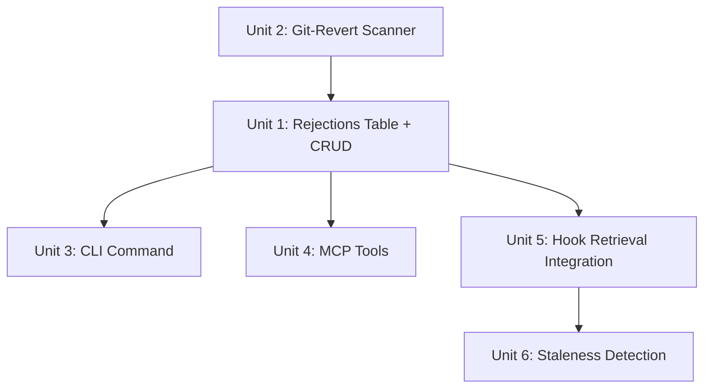

# feat: Rejected approaches log

## Overview

Add a system for capturing and surfacing "we tried X on file Y, it failed because Z" so that agents don't repeat abandoned approaches across sessions.

## Problem Frame

The biggest time sink in agent-assisted development: proposing an approach the user already tried and abandoned. Git history shows what was committed, not what was reverted or never merged. Conversation context dies when sessions end. Analysis of sextant's own history found 10 concrete rejected approaches — half exist only in human memory, not in parseable git signals.

ADR adoption research shows that systems requiring manual writes without prompting die within weeks. The capture mechanism must be lower-friction than the expected cost of repeating the mistake.

(see origin: `docs/ideas/003-rejected-approaches-log.md` for full research findings)

## Requirements Trace

- R1. Store rejection records in graph.db with file/symbol association
- R2. CLI command for manual capture (`sextant reject`)
- R3. MCP tool for agent-initiated capture (`sextant_reject`)
- R4. Surface relevant rejections in hook context injection when the prompt references affected files
- R5. Staleness detection: auto-flag when referenced files change substantially
- R6. Query interface to list/search rejections (`sextant rejections`, MCP `sextant_rejections`)
- R7. Git-revert scanning as a draft rejection source during `sextant scan`

## Scope Boundaries

- No auto-detection of rejection patterns from conversation text (future work — requires hook that reads user prompt content for correction signals)
- No cross-project rejection sharing (rejections are per-project in graph.db)
- No expiry cron or background pruning — staleness is checked on query/scan
- No PR comment scanning (would require GitHub API auth setup beyond `gh` CLI)
- Rejections are advisory context for agents, not blocking constraints

## Context & Research

### Relevant Code and Patterns

**Hook retrieval pipeline (where rejections will be surfaced):**
1. `commands/hook-refresh.js` — classifies prompt, runs graph-retrieve + zoekt, formats results
2. `lib/classifier.js` — extracts query terms from prompt. These terms can match against rejection `files` and `description`
3. `lib/format-retrieval.js` — formats results as compact markdown for `<codebase-retrieval>`
4. `lib/graph-retrieve.js` — fast graph queries in <50ms. Rejection lookup follows same pattern.

**Graph.db schema extension pattern:** Same as blast radius — `CREATE TABLE IF NOT EXISTS` in `ensureSchema()`. No migrations.

**CLI command pattern:** `commands/*.js` exporting `{ run }`, registered in `bin/intel.js` commandMap.

**MCP tool pattern:** Handler function in `mcp/server.js`, registered in TOOLS array and toolHandlers dispatch.

### Institutional Learnings

- ADR abandonment: documentation decay, perceived overhead, scope creep, workflow friction, status staleness (InfoQ research)
- Codified Context paper: structured tables of known failure modes with symptoms/causes/fixes drove correct first-attempt implementations
- Factory.ai lint approach: codify anti-patterns as failing rules — works for codifiable patterns but not design-level rejections
- Claude Code Auto Memory: captures corrections semi-automatically but not structured rejection reasoning

### External References

- MADR template (Architecture Decision Records)
- Codified Context paper (arxiv 2602.20478) — 24.2% infrastructure overhead justified by >80% short prompts
- Mem0 (arxiv 2504.19413) — conflict detection, TTL-based pruning
- RFC processes (Rust, React, Go) — rejection is a normal documented outcome

## Key Technical Decisions

- **Store in `rejections` table in graph.db, not separate files**: Follows sextant's "graph.db is single source of truth" principle. Enables fast SQL queries during hook retrieval (<5ms). File-based storage would require directory scanning and parsing during the hook's 200ms budget.

- **File-path-indexed, not keyword-indexed**: Rejections are associated with specific file paths via a JSON array column. The hook already extracts file paths from prompts (via the classifier). This makes the lookup fast and precise: "is there a rejection for any file the user is editing?" File paths are the most reliable association key because sextant already tracks them.

- **Three capture channels, not one**: Manual CLI (`sextant reject`), agent MCP tool (`sextant_reject`), and git-revert scanning. Each channel serves a different friction level. The CLI is the primary channel; MCP enables agent-assisted capture; git scanning catches explicit reverts.

- **Staleness by file change detection, not TTL**: A rejection for `lib/graph.js` written 6 months ago is still valid if graph.js hasn't been substantially rewritten. A rejection written yesterday is stale if the file was completely refactored today. Track `size_bytes` at rejection creation time, compare on query. Flag as stale when file size changes >50%.

- **Advisory, not blocking**: Rejections are injected as context ("Note: X was tried here and abandoned because Y"), not as constraints. The agent can choose to try the approach anyway if circumstances have changed.

## Open Questions

### Resolved During Planning

- **Q: Separate files or database table?** → Database table. Faster queries, consistent with graph.db pattern, no directory scanning in hooks.
- **Q: How to detect staleness?** → Compare file size at creation time vs current. >50% change = stale. Simple, cheap, doesn't require content diffing.
- **Q: Should agent be able to create rejections autonomously?** → Yes, via MCP tool, but the tool description should encourage the agent to confirm with the user before logging.

### Deferred to Implementation

- **Q: Exact prompt patterns that trigger rejection surfacing.** The classifier extracts terms and file paths — need to test whether existing term extraction reliably identifies file paths from natural prompts like "fix the scoring bug in retrieve.js."
- **Q: How many rejections per file before it becomes noise?** May need a per-file cap or recency filter. Observe in practice.

## Implementation Units



- [ ] **Unit 1: Rejections table and CRUD operations**

**Goal:** Add the `rejections` table to graph.db with insert, query, update, and delete operations.

**Requirements:** R1

**Dependencies:** None

**Files:**
- Modify: `lib/graph.js` (schema in ensureSchema, CRUD functions)
- Test: `test/graph.test.js` (rejections CRUD tests)

**Approach:**
- Add to `ensureSchema()`:
  ```sql
  CREATE TABLE IF NOT EXISTS rejections (
    id INTEGER PRIMARY KEY AUTOINCREMENT,
    description TEXT NOT NULL,
    reason TEXT NOT NULL,
    files TEXT,
    symbols TEXT,
    source TEXT DEFAULT 'manual',
    status TEXT DEFAULT 'active',
    created_at TEXT,
    file_sizes TEXT
  );
  CREATE INDEX IF NOT EXISTS idx_rejections_status ON rejections(status);
  ```
- `files` and `symbols` are JSON arrays stored as TEXT. `file_sizes` is a JSON object mapping file paths to their size_bytes at rejection creation time (for staleness detection).
- Add `insertRejection(db, { description, reason, files, symbols, source })` — auto-populates created_at and file_sizes by querying current file metadata from the `files` table.
- Add `findRejectionsForFiles(db, filePaths, opts)` — query active rejections where any file in the JSON array matches. Uses `json_each()` SQLite function for JSON array queries, or falls back to LIKE matching if json_each is unavailable in sql.js.
- Add `updateRejectionStatus(db, id, status)` — set status to 'stale' or 'expired'.
- Add `listRejections(db, opts)` — list all rejections with optional status filter.
- Add `deleteRejection(db, id)`.

**Patterns to follow:**
- `replaceReexports()` for insert pattern
- `findExportsBySymbol()` for query pattern
- `setMetaValue()`/`getMetaValue()` for simple update pattern

**Test scenarios:**
- Happy path: insert rejection with files + reason, query back by file path, verify all fields
- Happy path: insert rejection with symbols, query by file, symbols present in result
- Happy path: `findRejectionsForFiles(db, ["lib/graph.js"])` returns rejections associated with that file
- Happy path: `findRejectionsForFiles(db, ["lib/graph.js"])` does NOT return rejections for unrelated files
- Edge case: rejection with multiple files — matches query for any one of them
- Edge case: `findRejectionsForFiles` with status filter 'active' excludes 'stale' rejections
- Edge case: empty files array → rejection still created (global rejection, not file-scoped)
- Happy path: `listRejections` returns all, `listRejections({status: 'active'})` filters
- Happy path: `updateRejectionStatus` changes status, subsequent query reflects it
- Happy path: `deleteRejection` removes the record

**Verification:**
- All existing graph.test.js tests still pass
- New rejection CRUD tests pass
- Schema appears on existing databases without manual migration

---

- [ ] **Unit 2: Git-revert scanner**

**Goal:** During `sextant scan`, detect `git revert` commits and create draft rejection records.

**Requirements:** R7

**Dependencies:** Unit 1 (rejections table)

**Files:**
- Create: `lib/git-rejections.js` (git-revert detection logic)
- Modify: `commands/scan.js` (call git-rejection scanner after index build)
- Test: `test/git-rejections.test.js`

**Approach:**
- `scanGitReverts(root, opts)` — runs `git log --all --grep="Revert" --format="%H %s" -n 50` to find revert commits. For each, extract:
  - The original commit SHA from the message (convention: `Revert "original message"` or `This reverts commit <sha>`)
  - The affected files from `git diff --name-only <revert-sha>~1 <revert-sha>`
  - Use the revert commit message as the description
- For each detected revert, check if a rejection with `source = 'git-revert'` and `source_commit = <sha>` already exists (idempotent).
- Create rejection with `source: 'git-revert'`, `status: 'active'`, `reason: <original commit message>`.
- Called from `scan.js` after the index build phase, gated by `opts.scanReverts !== false`.

**Patterns to follow:**
- `lib/git.js:getGitInfo()` for git command execution pattern
- `spawnSync` with `encoding: "utf8"` and timeout

**Test scenarios:**
- Happy path: repository with a revert commit → scanner creates a rejection record with correct files and description
- Happy path: running scanner twice → idempotent, doesn't create duplicate rejections
- Edge case: no revert commits → no rejections created, no error
- Edge case: revert commit with no parseable original SHA → still creates rejection with available info
- Edge case: not a git repository → returns empty, no crash
- Error path: git command fails → returns empty, no crash

**Verification:**
- Scanner runs without error on sextant's own repo
- Idempotent on repeated runs

---

- [ ] **Unit 3: CLI command (`sextant reject` and `sextant rejections`)**

**Goal:** CLI interface for creating and listing rejection records.

**Requirements:** R2, R6

**Dependencies:** Unit 1

**Files:**
- Create: `commands/reject.js`
- Create: `commands/rejections.js`
- Modify: `bin/intel.js` (register both commands)
- Test: manual CLI verification (integration test optional)

**Approach:**
- `sextant reject "description" --files lib/graph.js,lib/intel.js --why "reason" [--symbols foo,bar]`
  - Parses flags with `flag(process.argv, "--files")` etc.
  - Calls `graph.insertRejection(db, { description, reason, files, symbols, source: 'manual' })`
  - Prints confirmation with the rejection ID
- `sextant rejections [--file <path>] [--status active|stale|all] [--json]`
  - Lists rejections, optionally filtered by file or status
  - Default: active only. `--status all` shows everything.
  - Pretty output with color coding for status (green=active, yellow=stale)
  - `--json` for machine-readable output

**Patterns to follow:**
- `commands/retrieve.js` for flag parsing and output formatting
- `commands/health.js` for `--pretty`/`--json` output modes

**Test scenarios:**
- Happy path: `sextant reject "foo" --files lib/a.js --why "broke"` creates record, prints confirmation
- Happy path: `sextant rejections` lists active rejections
- Happy path: `sextant rejections --file lib/a.js` filters to that file
- Edge case: `sextant reject` with no description → error message with usage
- Edge case: `sextant rejections` with no rejections → "No rejections found"

**Verification:**
- Commands registered in bin/intel.js
- Create + list round-trip works

---

- [ ] **Unit 4: MCP tools (`sextant_reject` and `sextant_rejections`)**

**Goal:** MCP interface for agent-initiated rejection capture and query.

**Requirements:** R3, R6

**Dependencies:** Unit 1

**Files:**
- Modify: `mcp/server.js` (add two tools + handlers)
- Test: `test/mcp-server.test.js` (tool registration + response shape)

**Approach:**
- `sextant_reject` tool: input `{ description, reason, files?, symbols? }`. Creates rejection with `source: 'agent'`. Returns the created record.
- `sextant_rejections` tool: input `{ file?, status? }`. Returns matching rejection records.
- Both follow the existing handler pattern: validate params, ensureInit, compute, return content array.
- Tool descriptions should note that `sextant_reject` is for logging approaches that were tried and abandoned, encouraging the agent to confirm with the user.

**Patterns to follow:**
- `handleSearch`, `handleRelated` in mcp/server.js

**Test scenarios:**
- Happy path: `sextant_reject` with valid params creates record, returns JSON with id
- Happy path: `sextant_rejections` with file filter returns matching records
- Edge case: `sextant_reject` missing required `description` → isError response
- Edge case: `sextant_rejections` with no matches → empty array, not error

**Verification:**
- Tools appear in `tools/list` response
- Round-trip: create via MCP, query via MCP, record present

---

- [ ] **Unit 5: Hook retrieval integration**

**Goal:** Surface relevant rejections in `<codebase-retrieval>` when the user's prompt references affected files.

**Requirements:** R4

**Dependencies:** Units 1, 4

**Files:**
- Modify: `commands/hook-refresh.js` (add rejection lookup to retrieval pipeline)
- Modify: `lib/format-retrieval.js` (add rejection section to output format)

**Approach:**
- In `hook-refresh.js`, after the classifier extracts query terms and file paths: call `graph.findRejectionsForFiles(db, extractedFilePaths)` to find active rejections.
- If rejections found, append a "Rejected approaches" section to the `<codebase-retrieval>` output:
  ```markdown
  ### Rejected approaches
  - **lib/graph.js**: Shared SQLite connection pool — WAL + concurrent writes = SQLITE_BUSY (2026-03-30)
  ```
- Budget: rejection lookup is a single SQL query, <5ms. Well within the 200ms shared deadline.
- Pass through `stripUnsafeXmlTags()` before stdout emission.
- File path extraction from prompts: the classifier already extracts terms. File paths in prompts (e.g., "fix lib/graph.js") will appear as terms. Match these against rejection `files` arrays.

**Patterns to follow:**
- Existing retrieval injection flow in `hook-refresh.js`
- `formatRetrieval()` in `lib/format-retrieval.js` for markdown formatting

**Test scenarios:**
- Happy path: prompt mentions "lib/graph.js", active rejection exists for that file → rejection appears in output
- Happy path: prompt mentions a file with no rejections → no rejection section in output
- Edge case: rejection exists but status is 'stale' → not surfaced
- Edge case: multiple rejections for same file → all surfaced, most recent first
- Integration: rejection section is compact (<200 chars per rejection) and fits within context budget
- Integration: output passes through `stripUnsafeXmlTags()` without corruption

**Verification:**
- Rejection appears in hook output when file path is mentioned in prompt
- No rejection section when no matches
- Hook stays within 200ms budget

---

- [ ] **Unit 6: Staleness detection**

**Goal:** Auto-detect when rejection records may be stale because referenced files have changed substantially.

**Requirements:** R5

**Dependencies:** Units 1, 4

**Files:**
- Modify: `lib/graph.js` (add `checkRejectionStaleness` function)
- Modify: `commands/scan.js` (call staleness check after scan)
- Modify: `lib/intel.js` (optionally call staleness check after `updateFile`)

**Approach:**
- `checkRejectionStaleness(db)` — for each active rejection, compare stored `file_sizes` against current file metadata in the `files` table. If any referenced file's `size_bytes` has changed by >50% from the stored value, update rejection status to 'stale'.
- Called during `sextant scan` (comprehensive check) and optionally during `updateFile` (incremental, only checks rejections for the updated file).
- Stale rejections are not deleted — they're excluded from hook retrieval but visible via `sextant rejections --status all`.
- A stale rejection can be manually reactivated via `sextant rejections --reactivate <id>` if the user determines it's still valid.

**Patterns to follow:**
- `fileMetaByPaths()` for batch metadata lookup
- Health metric pattern in `summary.js` for surfacing staleness stats

**Test scenarios:**
- Happy path: rejection created when file is 500 bytes, file grows to 800 bytes (60% change) → marked stale
- Happy path: rejection created when file is 500 bytes, file grows to 600 bytes (20% change) → stays active
- Edge case: referenced file deleted → rejection marked stale
- Edge case: rejection references multiple files, only one changed substantially → marked stale (conservative)
- Edge case: no rejections exist → function returns cleanly
- Happy path: stale rejection excluded from `findRejectionsForFiles` default query
- Happy path: stale rejection visible with `--status all` flag

**Verification:**
- Staleness check runs during scan without error
- File size change triggers stale status
- Stale rejections excluded from hook retrieval

## System-Wide Impact

- **Interaction graph:** Hook retrieval gains one additional SQL query per prompt (~5ms). Scan gains git-revert scanning (~100ms, one-time). No impact on watcher flush cycle.
- **Error propagation:** Rejection lookup failure is non-fatal — catch and skip, no impact on retrieval results.
- **State lifecycle:** `rejections` table auto-created on next `loadDb()`. Existing databases get the table without manual migration. Staleness check is lazy (on scan or query), not eager.
- **API surface parity:** Two new MCP tools (`sextant_reject`, `sextant_rejections`). Two new CLI commands. No existing APIs changed.
- **Integration coverage:** End-to-end test: create rejection → prompt mentions file → rejection appears in hook output.
- **Unchanged invariants:** Import/export extraction unchanged. Scoring unchanged. Summary generation unchanged. Eval harness unaffected.

## Risks & Dependencies

| Risk | Mitigation |
|------|------------|
| Capture friction too high → nobody writes rejections | Three channels (CLI, MCP, git-scan) at different friction levels. MCP tool enables agent-assisted capture. Git scanning is automatic. |
| Rejection fatigue — too many rejections surfaced | File-path-scoped retrieval (only for files in the current prompt). Stale rejections auto-excluded. Per-query cap if needed. |
| sql.js `json_each()` not available | Fallback to LIKE-based matching: `WHERE files LIKE '%"lib/graph.js"%'`. Less precise but functional. Test during implementation. |
| Staleness heuristic (50% size change) is too aggressive or too conservative | Start with 50%, observe. Easy to tune — it's a single constant. Can add content hash comparison later if needed. |
| Git-revert scanner produces false positives (reverts for staging reasons, not design rejection) | Draft rejections from git require review. `source: 'git-revert'` distinguishes them from manual entries. User can delete false positives. |

## Sources & References

- **Origin document:** [docs/ideas/003-rejected-approaches-log.md](../ideas/003-rejected-approaches-log.md)
- Related code: `lib/graph.js` (schema pattern), `commands/hook-refresh.js` (retrieval injection), `lib/classifier.js` (term extraction)
- Research: ADR/MADR adoption, Codified Context paper (arxiv 2602.20478), Mem0 (arxiv 2504.19413), Factory.ai linting
- Institutional learnings: `docs/solutions/logic-errors/parallel-correctness-fixes-and-test-hardening.md`
